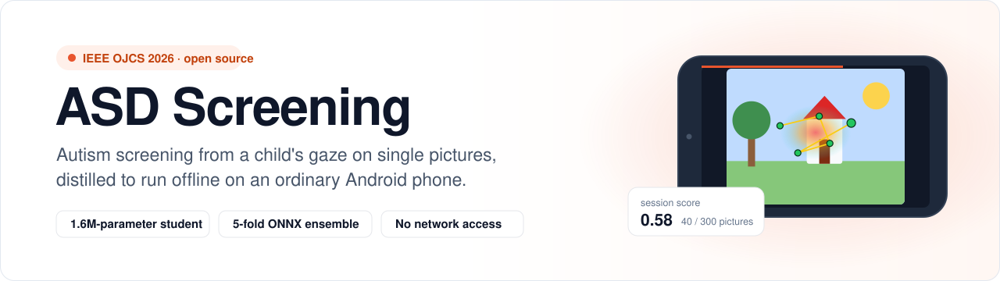
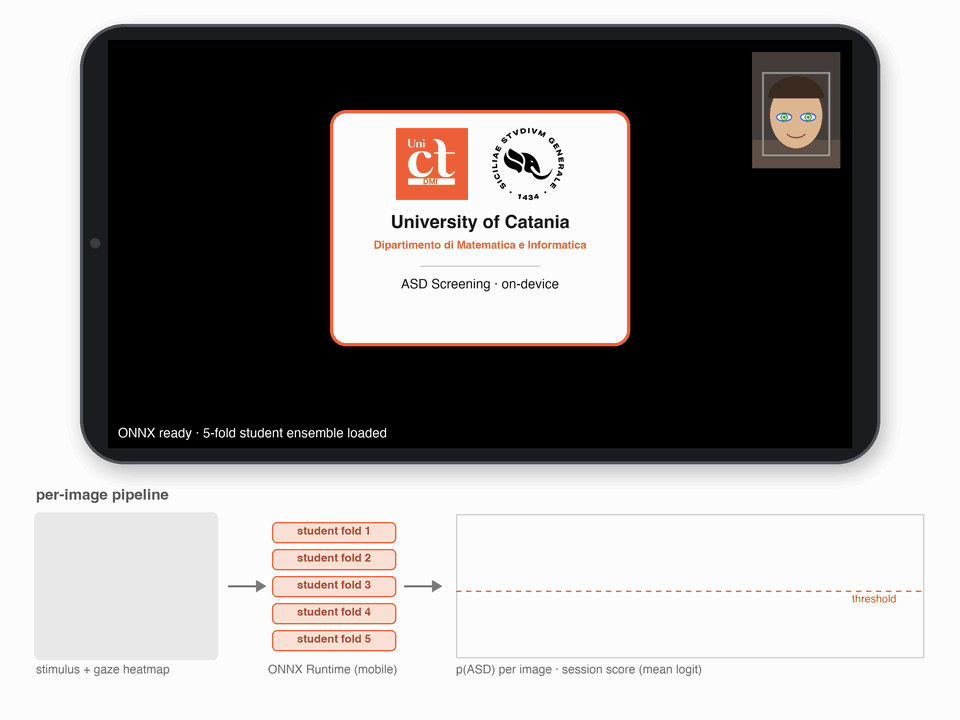
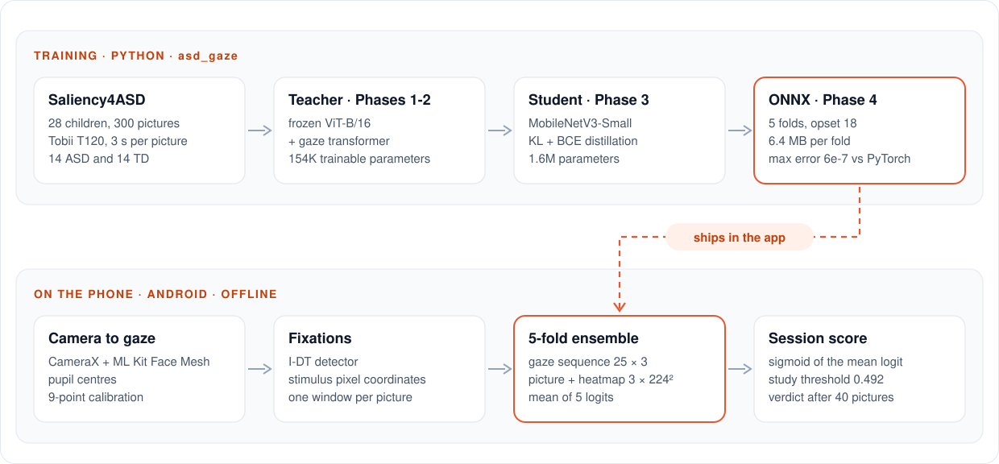

<p align="center">
  <picture>
    <source media="(prefers-color-scheme: dark)" srcset="docs/assets/banner-dark.svg">
    
  </picture>
</p>

<p align="center">
  <a href="https://doi.org/10.1109/OJCS.2026.3738736"></a>
  <a href="https://github.com/spatam/ASD-Screening-Android-APP/releases/latest"></a>
  <a href="https://github.com/spatam/ASD-Screening-Android-APP/actions/workflows/android.yml"></a>
  <a href="https://github.com/spatam/ASD-Screening-Android-APP/actions/workflows/python.yml"></a>
  <a href="LICENSE"></a>
  <a href="https://doi.org/10.5281/zenodo.2647418"></a>
</p>

<p align="center">
  Code, models and Android app for<br>
  <a href="https://doi.org/10.1109/OJCS.2026.3738736"><b>Protocol-Aware, On-Device Per-Image ASD Classification on Saliency4ASD via Multi-Stream Distillation</b></a><br>
  Massimo Orazio Spata<sup>*</sup>, Mirko Casu<sup>*</sup>, Francesco Rundo, Sebastiano Battiato<br>
  Department of Mathematics and Computer Science, University of Catania<br>
  <i>IEEE Open Journal of the Computer Society</i>, 2026 · <sup>*</sup>equal contribution
</p>

<p align="center">
  
  <br><sub>A simulated session with drawn pictures. The real test shows the 300 Saliency4ASD photos.</sub>
</p>

> [!IMPORTANT]
> This is a research prototype. It is not a medical device, and it must not be used to diagnose or rule out autism. Its models learned from 28 children recorded in one laboratory.

## At a glance

- **One picture, one prediction.** A two-stream teacher (frozen ViT-B/16 plus a small gaze transformer) looks at a picture and at the fixations a child made on it. A 1.6M-parameter MobileNetV3 student learns from the teacher and runs on the phone as a five-fold ONNX ensemble.
- **Protocols that tell the truth.** On the usual Saliency4ASD subset the student reaches AUC 0.989, yet the identity of the picture alone scores 0.98 there. The deployment protocol balances ASD and TD viewers within every picture and removes that shortcut. Under it the student scores 0.686 per picture and 0.959 per child once a session is pooled, and 40 pictures (under three minutes) keep 0.947.
- **Offline by design.** CameraX and ML Kit Face Mesh estimate gaze from the front camera after a nine-point calibration. The app has no network permission and stores no camera frames.
- **Tested parity.** The Java preprocessing matches the Python training code, including a bit-exact port of Pillow's resize, and unit tests check it on every commit.

[How it works](#how-it-works) · [Results](#results) · [Quick start](#quick-start) · [Reproduce the paper](#reproduce-the-paper) · [Inside the app](#inside-the-app) · [Repository layout](#repository-layout) · [Licenses](#data-licenses-and-credits) · [Citation](#citation)

## How it works

<p align="center">
  <picture>
    <source media="(prefers-color-scheme: dark)" srcset="docs/assets/pipeline-dark.svg">
    
  </picture>
</p>

Training runs in four phases on [Saliency4ASD](https://doi.org/10.1145/3304109.3325818): 14 children with ASD and 14 typically developing children who looked at 300 pictures for 3 s each. For every (child, picture) pair the model receives two inputs. The first is the sequence of fixations (position and duration, up to 25). The second is the picture blended with a heatmap of those fixations. Every phase uses five-fold cross-validation grouped by child, so no child sits in both the training and the validation split of a fold.

| Phase | Model | Entry point | Implementation |
| :---: | --- | --- | --- |
| 1 | two-stream teacher, random init, BCE, 50 epochs | [`train_phase1.py`](training_scripts/train_phase1.py) | [`asd_gaze/train_phase2.py`](asd_gaze/train_phase2.py) |
| 2 | teacher fine-tuned with focal loss, label smoothing, mixup and gaze jitter | [`train_phase2.py`](training_scripts/train_phase2.py) | [`asd_gaze/train_phase3.py`](asd_gaze/train_phase3.py) |
| 3 | MobileNetV3-Small student distilled with KL + BCE (T = 4, α = 0.7) | [`train_phase3.py`](training_scripts/train_phase3.py) | [`asd_gaze/train_distill.py`](asd_gaze/train_distill.py) |
| 4 | ONNX export, opset 18, one file per fold | [`export_onnx.py`](training_scripts/export_onnx.py) | [`asd_gaze/export_onnx.py`](asd_gaze/export_onnx.py) |

The module names predate the final numbering of the phases, which is why `asd_gaze/train_phase2.py` trains Phase 1. The entry points in `training_scripts/` follow the paper.

## Results

All numbers come from the paper. Per-child AUC averages the logits of a child's pictures.

| Protocol | What it tests | Records | Student AUC per picture | Student AUC per child |
| --- | --- | ---: | ---: | ---: |
| Retained subject (`subject`) | the classic subset of files with exactly 14 viewers | 2216 | **0.9894** | 1.0000 |
| Held-out stimulus (`stimulus`) | pictures the model has never seen | 7296 | 0.6338 | n/a |
| Deployment (`subject_all`) | children the model has never seen, fixed pictures balanced by class | 6770 | 0.6859 | **0.9592** |

<details>
<summary><b>Why three protocols?</b></summary>

In the retained-subject subset, 134 of the 149 pictures appear in one class only. A model can therefore learn which pictures belong to which class, and an image-only baseline reaches AUC 0.9825 with no gaze at all. The held-out-stimulus protocol shows how weak transfer to new pictures is. The deployment protocol matches how the app works: it shows the same pictures to a new child. Within every picture it keeps as many ASD as TD viewers, so the identity of the picture is worth exactly 0.5000 and any gain above chance comes from gaze. The student beats its own teacher under all three protocols despite being 53 times smaller.
</details>

**How many pictures does a session need?** Pictures drawn at random for each child of the deployment protocol, with the threshold and calibration fitted leave-one-subject-out (200 draws per row):

| Pictures | Session | AUC | Accuracy | Sensitivity | Specificity |
| ---: | ---: | ---: | ---: | ---: | ---: |
| 10 | 40 s | 0.886 | 0.810 | 0.803 | 0.816 |
| 20 | 1.3 min | 0.923 | 0.840 | 0.850 | 0.829 |
| **40** | **2.7 min** | **0.947** | **0.870** | **0.883** | **0.856** |
| 100 | 6.7 min | 0.959 | 0.863 | 0.883 | 0.843 |
| 200 | 13.3 min | 0.961 | 0.846 | 0.867 | 0.824 |

With 14 children per class these estimates carry a confidence interval of about ±0.10. They show that a gaze signal exists at the level of the individual child. They do not pin down its size, and they say nothing about other ages, devices or clinical settings.

## Quick start

### Try the app

1. Download the APK for your phone from [Releases](https://github.com/spatam/ASD-Screening-Android-APP/releases/latest). `arm64-v8a` fits almost every phone sold since 2017.
2. Download `TrainingDataset.rar` (835 MB) from [Zenodo record 2647418](https://zenodo.org/records/2647418), extract it and copy the `TrainingData/Images` folder to the phone.
3. Open the app, tap **Choose folder** and select that folder. The app checks the 300 pictures against their SHA-256 and keeps a private copy.
4. Put the phone on a stand about 35 cm from the child's eyes and follow the calibration dot. The verdict appears after 40 pictures (under three minutes). The full set of 300 takes 20 minutes.

The APKs contain no pictures, because the photos come from the MIT1003 collection and their copyright stays with the photographers.

### Build the app

```bash
git clone https://github.com/spatam/ASD-Screening-Android-APP.git
cd ASD-Screening-Android-APP
./gradlew assembleDebug
adb install app/build/outputs/apk/debug/app-arm64-v8a-debug.apk
```

The build needs JDK 17 or newer and the Android SDK. Android Studio provides both and opens the folder as it is.

`python scripts/fetch_saliency4asd.py --install-app-stimuli` copies the pictures into `app/src/main/assets/stimuli/`, and a build made after that skips the import step. Keep such builds to yourself, because they contain the photos.

### Run the models in Python

```bash
pip install -e .
python scripts/fetch_saliency4asd.py     # into data/saliency4asd
python examples/infer_onnx.py session --dataset data/saliency4asd --subject ASD_slot03 --images 40
python examples/infer_onnx.py image --stimulus picture.png --fixations fixations.csv
```

The deployment models saw all 28 dataset children during training, so a session built from them only shows that the pipeline runs. [`models/README.md`](models/README.md) describes both model sets, their inputs and their checksums.

## Reproduce the paper

```bash
pip install -r requirements.txt   # versions behind the released models
python scripts/fetch_saliency4asd.py
bash training_scripts/run_pipeline.sh --huiyu-dir data/saliency4asd --protocol subject_all
```

`run_pipeline.sh` trains the three phases, exports the students and writes per-fold and pooled metrics to the output folder (`runs/` by default). `--device` picks `cuda`, `mps` or `cpu`, and the `--skip-phase*` flags resume a partial run.

| `--protocol` | Paper name | Files | Records | Folds grouped by |
| --- | --- | --- | ---: | --- |
| `subject` (default) | retained subject | files with exactly 14 viewers | 2216 | child |
| `stimulus` | held-out stimulus | all 600 | 7296 | picture |
| `subject_all` | deployment | all 600, at most 14 viewers each, balanced by class | 6770 | child |

Under `subject_all` the paper distils the student from the Phase 1 teacher, because Phase 2 lowered the teacher's AUC there. The supplementary analyses run from the repository root:

| Script | Paper element |
| --- | --- |
| [`analysis/export_oof_predictions.py`](analysis/export_oof_predictions.py) | per-record out-of-fold predictions used by the scripts below |
| [`analysis/analyze_image_budget.py`](analysis/analyze_image_budget.py), [`make_budget_figure.py`](analysis/make_budget_figure.py) | picture-budget table, figure and the screening, standard and extended modes |
| [`analysis/check_selection_bias.py`](analysis/check_selection_bias.py) | permutation test for the ranking of informative pictures |
| [`analysis/diagnose_slot_consistency.py`](analysis/diagnose_slot_consistency.py) | permutation test that subject slots behave like stable children |
| [`analysis/measure_memory.py`](analysis/measure_memory.py), [`run_timing.sh`](analysis/run_timing.sh) | efficiency and cost tables |
| [`training_scripts/run_ablations.sh`](training_scripts/run_ablations.sh) | ablations and sanity checks (image only, random heatmap, spatial only) |
| [`analysis/make_verified_figures.py`](analysis/make_verified_figures.py) | summary figures, drawn from the table values |

Run them as modules, for example `python -m analysis.analyze_image_budget --oof-csv runs/oof_predictions.csv --out-prefix runs/budget`. GPU kernels are not deterministic, so a fresh run lands close to the published numbers without matching every digit. The released ONNX files are the models behind the tables.

## Inside the app

1. **Stimuli.** On first launch the app imports the 300 pictures from a folder you pick and verifies each one.
2. **Face and calibration.** It waits for a steady face, then shows nine targets that shrink to a dot. A poor fit repeats the calibration up to three times.
3. **Test.** Each picture stays on screen for 3 s, followed by 1 s of grey, as in the original recordings. The app recalibrates every 50 pictures.
4. **Per picture.** Gaze samples become fixations (I-DT). Pictures with less than 50% valid gaze or no fixation are skipped. The five students score the rest in a background thread.
5. **Session score.** The app reports the sigmoid of the mean logit. After 40 pictures it compares the score with 0.492, the threshold that best separates the 28 dataset children.

**Privacy.** Frames stay in memory and are discarded after gaze extraction. The manifest removes the network permissions that ML Kit adds, backups are off, and the app saves no frames or results. Without camera permission the app runs a demo mode with synthetic gaze, which is handy for checking the pipeline on an emulator.

**Parity with training.** [`asd_gaze/preprocessing.py`](asd_gaze/preprocessing.py) defines the model inputs, and [`Preprocessing.java`](app/src/main/java/it/unict/dmi/asdscreening/Preprocessing.java) and [`PilResize.java`](app/src/main/java/it/unict/dmi/asdscreening/PilResize.java) port it. [`scripts/make_parity_golden.py`](scripts/make_parity_golden.py) writes reference values from the Python side. The JVM tests then require the resize to match Pillow bit for bit and every model input to match within 2×10⁻⁴.

```bash
./gradlew testDebugUnitTest   # Java: parity with Python, scoring, fixations
pytest                        # Python: protocols, preprocessing, models, export
```

## Repository layout

```text
app/                    Android app (Java): camera, gaze, fixations, preprocessing, ONNX ensemble
  src/main/assets/        deployment models and the SHA-256 list of the 300 stimuli
  src/test/               JVM tests, including the Python parity check
asd_gaze/               Python library: dataset and protocols, models, losses, training, export
training_scripts/       paper entry points for the four phases, evaluation and ablations
analysis/               supplementary analyses behind the paper's tables and figures
examples/               ONNX inference on a picture or on a simulated session
models/                 model card, checksums and the retained-subject students
scripts/                dataset download and parity reference generator
tests/                  pytest suite
docs/assets/            README artwork
```

## Data, licenses and credits

- **Code and models:** [Apache-2.0](LICENSE). See [`NOTICE`](NOTICE). Commits before version 1.0.0 were released under CC0 1.0.
- **Training data:** Saliency4ASD by Duan et al. ([MMSys 2019](https://doi.org/10.1145/3304109.3325818), [Zenodo](https://zenodo.org/records/2647418), CC BY 4.0). Please cite it when you use the models.
- **Stimuli:** the 300 pictures come from [MIT1003](https://doi.org/10.1109/ICCV.2009.5459462) (Judd et al., ICCV 2009). They are not part of this repository or of the APKs.
- **Third-party software:** AndroidX and CameraX (Apache-2.0), ONNX Runtime (MIT), timm weights (Apache-2.0). The app also bundles Google ML Kit Face Mesh, which follows the [ML Kit terms](https://developers.google.com/ml-kit/terms) and is not open source.
- **Trademarks:** the name and logos of the University of Catania belong to the University and are not covered by the license.

## Citation

If you use this code or the models, please cite the paper and the dataset. GitHub's *Cite this repository* button reads [`CITATION.cff`](CITATION.cff).

```bibtex
@article{spata2026asd,
  author  = {Spata, Massimo Orazio and Casu, Mirko and Rundo, Francesco and Battiato, Sebastiano},
  title   = {Protocol-Aware, On-Device Per-Image {ASD} Classification on {Saliency4ASD} via Multi-Stream Distillation},
  journal = {IEEE Open Journal of the Computer Society},
  year    = {2026},
  pages   = {1--12},
  doi     = {10.1109/OJCS.2026.3738736}
}

@inproceedings{duan2019saliency4asd,
  author    = {Duan, Huiyu and Zhai, Guangtao and Min, Xiongkuo and Che, Zhaohui and Fang, Yi and Yang, Xiaokang and Guti{\'e}rrez, Jes{\'u}s and Le Callet, Patrick},
  title     = {A Dataset of Eye Movements for the Children with Autism Spectrum Disorder},
  booktitle = {Proceedings of the 10th ACM Multimedia Systems Conference},
  year      = {2019},
  doi       = {10.1145/3304109.3325818}
}
```

## Contact

Massimo Orazio Spata, corresponding author ([massimo.spata@unict.it](mailto:massimo.spata@unict.it)). Bug reports and questions are welcome in [Issues](https://github.com/spatam/ASD-Screening-Android-APP/issues). Changes are listed in [`CHANGELOG.md`](CHANGELOG.md), and [`CONTRIBUTING.md`](CONTRIBUTING.md) explains how to run the checks.
